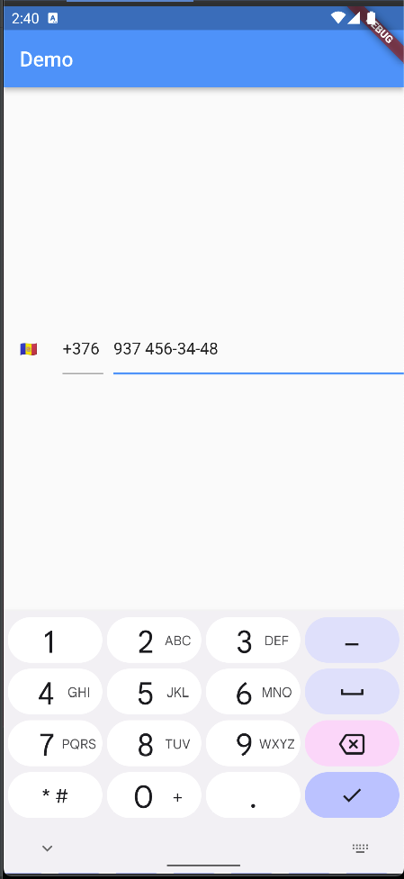

# Another Intl Phone Number Input

A simple and customizable flutter package for inputting phone number in intl / international format uses Google's libphonenumber with ability to change country code manually using keyboard.

Inpired by <a href="https://github.com/natintosh/intl_phone_number_input">Intl Phone Number Input </a>


<!--  -->

## Features

* Phone input
* Phone number formatting using country and Google's libphonenumber
* Selection country and country code by popup with search
* Manual input of country code
* [BETA] Auto-selection of country and country code by phone settings

## Getting started

1. Add to `pubspec.yaml`

```yaml 
...
dependencies:
...
another_intl_phone_number_input
...

```

```dart
import 'package:another_intl_phone_number_input/another_intl_phone_number_input.dart';
```

## Usage


```dart
 AnotherInternationalPhoneNumberInput(
    onInputChanged: (number) {
        print('onInputChanged: ' + number.toString());
    },
 )
```

More detailed example you can observe in `/example/lib/main.dart'.
